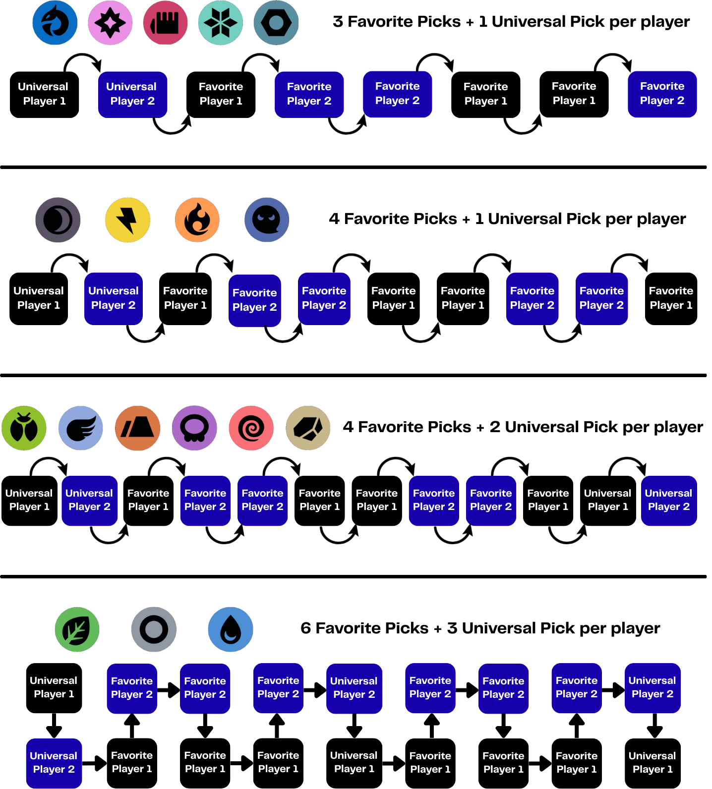
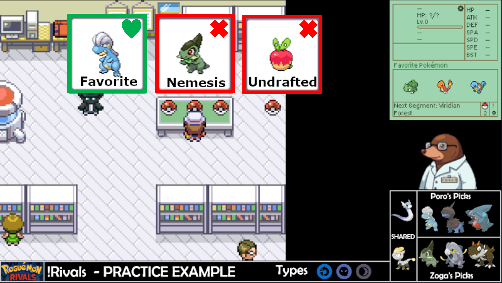
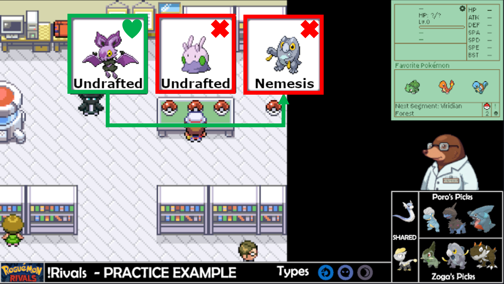
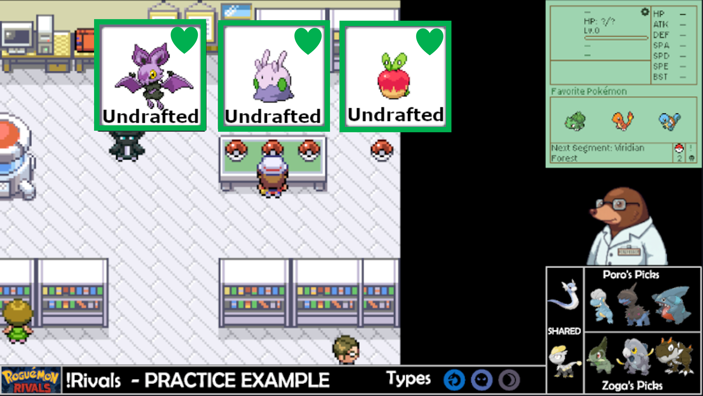
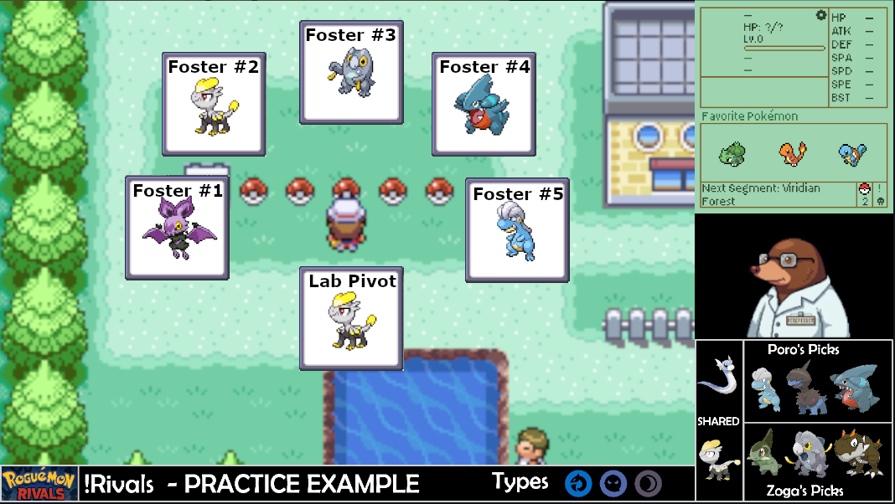
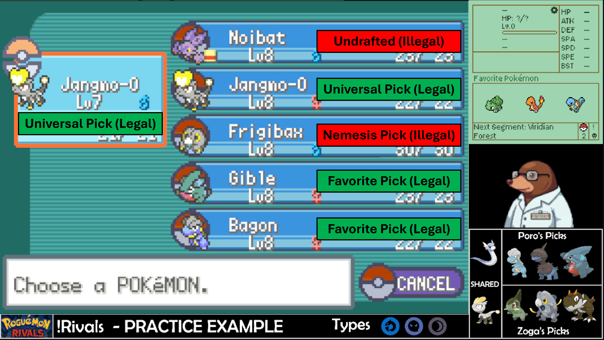
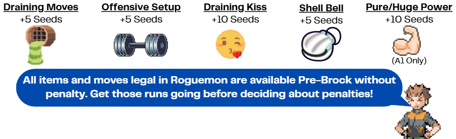

# Roguemon Rivals Tournament Series

### [DRAFTING PHASE](#DRAFTING-PHASE) | [PIVOTING GUIDELINES](#PIVOTING-GUIDELINES) | [TIEBREAKERS](#TIEBREAKERS) | [ALTERNATIVE FORMATS](#ALTERNATIVE-FORMATS) | [RESOURCES](#RESROUCES) | [FAQ](#FREQUENTLY-ASKED-QUESTIONS) |

---

Welcome to Roguemon Rivals! Roguemon Rivals is a competitive format for the Roguemon Pokemon challenge where two players draft Pokemon across 3 types and battle for the title of Pokemon champion. This format builds off of the fan-made Roguemon created by Crozwords (a roguelike mod of FireRed/LeafGreen) and incorporates a drafting phase, type-based victories, and marathon (longest run) type competitive gameplay.

---

<h1 align="center">Drafting Phase</h1>

Players will draft favorites which they must run and universal picks which both players can run. This can be organized through voice chat or text chat in Discord. In the past Discord DMs have worked very successfully for the drafting phase. The overall process should take about 5 minutes if you have a general idea who you want to draft. To decide which player comes first is entirely arbitrary unless you have played against them before. Simply using a coin toss will suffice. The player that wins the coin toss will pick first on Types 1 and 3 while the player that loses the coin toss will go first on Type 2. Feel free to use this template to guide your drafting phase:
Once players have drafted all of their Pokemon, the Running phase begins. This means go play! This will proceed like normal A2 Roguemon with the exception of how you pivot (see below).

### 
Drafting Phase Reference

**Pokemon Rankings by Zoga: (Good for pivot data opinions may vary)**  
[👉 Click here to view the Pokemon Rankings](https://docs.google.com/spreadsheets/d/1tiS6qI93a8kvGv_6gLdTAVDttsU-ztQQgtx_xshBj_c/edit)

**Draft Tracker:**  
[👉 Click here to view the Draft Tracker](https://docs.google.com/spreadsheets/d/1w-vIBTVtaFTtdZ5n6jUGxO-SaW-L_5P-QvtL8cfddMo/edit?gid=1594516166#gid=1594516166)

---

<h1 align="center">PIVOTING GUIDELINES</h1>

Pivoting is dictated by what you drafted. Please note that there is **no scouting**. Your choices can only come from the lab and the abandoned balls outside the lab. The difficulty of Rivals is created by running your suboptimal favorites rather than choosing the best Pokemon in each seed. If you are lucky your favorite will be the best, but from experience with the format it is unlikely. With that in mind follow these rules:

### Lab Priorities:
1.	You must select a drafted pokemon (Universal or Your Favorite)

<strong>Example</strong>

  

In this example, there is a favorite (Pokemon you drafted or universal pick), a nemesis (Pokemon your opponent drafted), and an undrafted pick.

2.	If you don’t have a favorite, you must fight your opponent’s favorite

<strong>Example</strong>

  

3.	If there are no favorites for either player, you have free choice.

<strong>Example</strong>

  

### Abandoned Balls:
After beating the Lab Rival, you must pick up the 5 abandoned balls outside the lab. These 6 pokemon are your potential pivots. These pivots follow the same rules as the lab pivot. Therefore, you must run a favorite that you drafted or a universal pick. If no favorites are available, then you are allowed free choice of any non-nemesis Pokemon (drafted by your opponent).

<strong>Example</strong>

  

In this example, the player picks up the 5 abandoned balls immediately to see the potential pivots. After checking the balls, the player determines the are able to run **Jangmo-O (lvl 7)**, **Jangmo-O (lvl 8)**, **Gible**, and **Bagon**. This is because **Jangmo-O** was a universal pick that any player can run, while **Gible** and **Bagon** were specifically drafted by the player. On the other hand, **Noibat** is not runnable because drafted pokemon take priority of undrafted pokemon. Additionally, **Frigibax** is a nemesis (opponent drafted pokemon) and is unrunnable.

**Please note that these pivots are most likely going to be sub-optimal. This is the challenge of Rivals, so make sure your drafting phase is setting you up for success!**

Once you have selected your pivot you are ready to start running! Normal A2 Roguemon rules apply so please refer to [Roguemon.gg](https://github.com/Crozwords/Roguemon) for rules clarification or the [Roguemon Discord](https://discord.gg/YPhF5D3P).

---

<h1 align="center">Tiebreakers</h1>

In the case of both players ending on the same segment, there are a few tiebreakers to determine the winner:
1) The player that defeated the most trainers in the final segment wins the tiebreaker.
2) If both players defeated the same number of trainers, then the player who defeated the most pokemon in the final segment wins the tiebreaker.
3) If both players defeated the same number of trainers and pokemon, then the player who reached the personal best in the lower number of seeds win the tiebreaker.

**Please note that the final tiebreaker is especially pertinent for tiebreakers that beat Champion (frequently happens in A1).**

#### Penalty Modifiers
An additional tiebreaker condition can be applied to Rivals. Please note that these should be discussed ahead of time with your opponent and only apply to cases invovling the third tiebreaker.

A penalty modifier increases your overall seed count if a specific condition is activated during your longest PB. Please note that this only applies to the third tiebreaker (Players defeating the same number of trainers and pokemon). The modifers are as follows:

---

<h1 align="center">Alternative Formats</h1>

## Tournament Series:

[Winter Invitational (2026)](https://github.com/ThePorofessor/Roguemon-Rivals-Tournament-Series)

---

## Alphabet Draft
An alphabet draft is very similar to the normal Roguemon Rivals experience with the exception of what you are drafting. Rather than selecting specific pokemon, you will be drafting the letters of the alphabet. Any pokemon starting with the letter is runnable! Ideally this is a format that excels with 8 players however it is feasible with at least 2. If playing with less than 4 players, each letter should only be drafted a single time.

### Round Structure
The alphabet draft will consist of 8 players in a free for all format battling it out across 100 Typeless seeds. Players will draft favorite letters that they are allowed to run and there will be no universal picks. Since all the letters will be drafted, players will only be allowed to run Pokemon starting with favorite letters! After 2 weeks players will be ranked based on their furthest PB.

### Drafting Rules
All players will get the chance to draft 6 favorite letters. To ensure fairness, pick order will be randomized and conducted through a snake style draft (1-2-3-4-5-6-7-8-8-7-6-5-4-3-2-1).
Please note that some letters are stronger than others. This could mean having a larger pivot pool (enabling more runs) and higher average BST (more likely to get a better PB). Therefore, make sure you draft wisely or you might be ball locked frequently.

### Pivoting Rules
While in the lab ALL Pokemon can be used to get out. There are no limits to what you pick off of the table. However once you are out of the lab, you must run a Pokemon starting with oen of your favorite letters. This is not always guaranteed based on how you drafted. If there are no favorites, then you may run the lab pokemon.

Let the chaos begin!

<strong>Letter Statistics (Amount of Pokemon)</strong>

Please note that for these stats Pokemon that have different unique forms (Burmy, Pumpkaboo, etc.) are only counted once. Additionally, everything was calculated through ChatGPT so there will be errors.
  
| Letter | Number of Pokemon | Average BST | Lowest BST| Highest BST |
|:---:|---|---|---|---|
| 
A
 | 
10
 | 
316.80
 | 
190 (Azurill)
 | 
401 (Archen)
 |
| 
B
 | 
21
 | 
287.95
 | 
190 (Blipbug)
 | 
460 (BasculinW)
 |
| 
C
 | 
32
 | 
312.88
 | 
195 (Caterpie)
 | 
410 (Corsola/CorsolaG)
 |
| 
D
 | 
19
 | 
323.42
 | 
265 (Diglett/DiglettA)
 | 
415 (Dunsparce)
 |
| 
E
 | 
7
 | 
326.14
 | 
288 (Ekans)
 | 
360 (Elekid)
 |
| 
F
 | 
17
 | 
313.41
 | 
200 (Feebas)
 | 
377 (Farfetch'd/Farfetch'dG)
 |
| 
G
 | 
23
 | 
346.82
 | 
290 (Gothita/Greavard)
 | 
455 (Giraffarig)
 |
| 
H
 | 
9
 | 
285.11
 | 
220 (Happiny)
 | 
330 (Hippopotas/Houndour)
 |
| 
I
 | 
3
 | 
254.33
 | 
210 (Igglybuff)
 | 
288 (Inkay)
 |
| 
J
 | 
2
 | 
309.50
 | 
300 (Jangmo-O)
 | 
319 (Joltik)
 |
| 
K
 | 
7
 | 
316.29
 | 
194 (Kricketot)
 | 
385 (Kubfu)
 |
| 
L
 | 
12
 | 
325.67
 |
 220 (Lotad)
 | 
385 (Lickitung)
 |
| 
M
 | 
28
 | 
317.03
 | 
200 (Magikarp)
 | 
435 (Misdreavus)
 |
| 
N
 | 
8
 | 
280.75
 | 
210 (Nymble)
 | 
375 (Nosepass)
 |
| 
O
 | 
4
 | 
342.00
 | 
308 (Oshawott)
 | 
385 (Onix)
 |
| 
P
 | 
32
 | 
318.53
 | 
205 (Pichu)
 | 
420 (Poipole)
 |
| 
Q
 | 
3
 | 
396.70
 | 
310 (Quaxly)
 | 
396.7 (Qwilfish/Hisuian Qwilfish)
 |
| 
R
 | 
13
 | 
280.75
 | 
198 (Ralts)
 | 
350 (Rufflet)
 |
| 
S
 | 
63
 | 
303.44
 | 
180 (Sunkern)
 | 
465 (Stantler)
 |
| 
T
 | 
24
 | 
304.50
 | 
210 (Tyrogue)
 | 
435 (Tangela)
 |
| 
U
 | 
0
 | 
0
 | 
0
 | 
0
 |
| 
V
 | 
9
 | 
310.90
 | 
260 (Venipede)
 | 
370 (Vullaby)
 |
| 
W
 | 
14
 | 
250.20
 | 
175 (Wishiwashi)
 | 
400 (Wailmer)
 |
| 
X
 | 
0
 | 
0
 | 
0
 | 
0
 |
| 
Y
 | 
5
 | 
303.80
 | 
253 (Yungoos)
 | 
390 (Yanma)
 |
| 
Z
 | 
5
 | 
277.00
 | 
240 (Zigzagoon/ZigzagoonG)
 | 
460 (Zorua/ZoruaH)
 |

---
<h1 align="center">RESOURCES</h1>

<strong>📁 Resources</strong>

- 📝 [Draft Template Sheet](https://docs.google.com/spreadsheets/d/1w-vIBTVtaFTtdZ5n6jUGxO-SaW-L_5P-QvtL8cfddMo/edit?gid=1594516166#gid=1594516166)
- 📈 [Scoreboard Template (Make a Copy)](https://docs.google.com/spreadsheets/d/1AbWa4WPAQiyzlvI2I5l_m0M3YqE-ZPL32wDu0jRsoHI/edit?gid=0#gid=0)
- :camera: [Pokemon Sprites (Sugimori and Global Artwork)](https://drive.google.com/drive/folders/1QnI2yFlTVyjq3geyzwmnrr3_cxNlNjzI?usp=sharing)

---

<h1 align="center">FREQUENTLY ASKED QUESTIONS</h1>

<strong> Do my opponent and I have to complete the types in the same order? </strong>

Absolutely not! You may play any of the three types selected for a round within the 2-week period. It is actually advised to mix and match based on your opponent’s personal best (PB). The goal is achieving the farthest run, not necessarily win it the seed. If you are ahead of your opponent, maybe hold off on the other seeds just in case they surpass you.
  

<strong> How do we decide who drafts first? </strong>

Rivals is a friendly competitive format. Flipping a coin is probably the easiest but you can get creative. If you have versed your opponent before, winner should get first pick on Types 1 and 3.
 

<strong> How should we approach a run that ends at Cycling Road? </strong>

Cycling Road can be …. troublesome. We understand that you can technically skip Cycling Road due to the lack of mandatory trainers. To ensure a positive competitive environment, we ask that you at least attempt Cycling Road if your opponent has a PB during this segment. If you need to end early that is fine, but a complete skip is frowned upon.
 

<strong> What happens if all lab mons are unselectable? </strong>

Unfortunately, that is a seed reset.
 

<strong> What happens if you only have 1 favorite but it has Pure/Huge Power? </strong>

Don't reset the seed! Play as if no favorites are available and chose any Pokemon that was not drafted by either player.
 

<strong> What happens if I my lab pokemon has Pure/Huge Power and I only have physical moves? </strong>

Thats a seed reset, but you will be refunded the seed. Please note this doesn't apply to type resistances.
 

<strong> If I get a non-favorite shiny, can I run that instead of a favorite? </strong>

Sure! The original ruleset of Roguemon does have a Shiny clause which we will permit. IIRC the original ruleset for Roguemon allows you to level it to 8 so the shiny has a chance.
 

<strong> How do the penalties for Shell Bell, draining moves, and offensive setup factor into my score? </strong>

These penalties are only factored into winning runs (which is a low chance in A2) and will be utilized for tie breakers if both players win a seed.
 

<strong> Do I need to stream every seed attempt? </strong>

Yes! In order to verify each run and guarantee a fair competitive environment the runs must be watchable. Please make sure that your VODs are available through your preferred streaming service.
 

<strong> Is Discord a permissible alternative to streaming? </strong>

Unfortunately, it is not since the VODs would not be viewable after you ended the run.
 

<strong> Is time machining allowed for simple mistakes? </strong>

To avoid an exhaustive list of yes and no’s, all use of time machine will be banned.
 

 
---

## Credits
Adapted Rules Created by: [ThePorofessor](https://www.twitch.tv/theporofessor) and [ZogaOak](https://www.twitch.tv/zogaoak)

Roguemon Rivals Format Created by: [iCrucialx](https://twitch.tv/icrucialx) and [Ceedsy](https://twitch.tv/ceedsy) 

Draft Tracker Created by: [iAmSlammer](https://www.twitch.tv/iAmSlammer)

Inspired by: [Roguemon by Crozwords](https://github.com/Crozwords/Roguemon)

<i>Roguemon Rivals is a fan-made competition format and not affiliated with Nintendo, Game Freak, or The Pokémon Company.</i>

